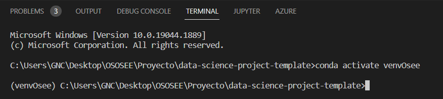

data-science-project-template
==============================

Organizacion del proyecto
------------

    ├── README.md          <- README principal para los desarrolladores usando este proyecto.
    ├── data
    │   ├── external       <- Datos de terceras fuentes.
    │   ├── interim        <- Datos intermedios que ya han sido transformados.
    │   ├── processed      <- Datos en forma final, listo para modelamiento.
    │   └── raw            <- Datos originales, datos inmutable sin ninguna transformacion.
    │
    ├── docs               <- Documentacion del proyecto, ver detalles.
    │
    ├── models             <- Modelos entrenados y serializados, prediccion de los modelos y resumenes.
    │
    ├── notebooks          <- Jupyter notebooks. donde se realizan las primeras pruebas antes de generar los scripts.
    │                         convencion para nonmbrar son las iniciales del creador seguido de "-" y una corta descripcion. ejemplo:
    │                         "1.0-jqp-initial-data-exploration".
    │
    ├── references         <- Diccionarios de datos, manuales y todos material que explique los datos.
    │
    ├── reports            <- Analisis generado puede ser como HTML, PDF, LaTex, etc.
    │   └── figures        <- Graficos y figuras generados usados en los reports.
    │
    ├── src                <- Codigo principal para el uso del proyecto.
    │   ├── __init__.py    <- Convierte al folder file en un modulo de Python.
    │   │
    │   ├── _01_Business_Understanding          <- Exploracion inicial para entender el negocio
    │   │   └── 01BusinessUnderstanding.py
    │   │
    │   ├── _02_Data_Understanding              <- Exploracion para entender los datos y sus disponibilidad.
    │   │   └── 02DataUnderstanding.py
    │   │
    │   ├── _03_Data_Preparation                <- Seleccionar, ordenar, agrupar, remover, etc. los datos para alcanzar los objetivos.
    │   │   └── 03DataPreparation.py
    │   │
    │   ├── _04_Modeling                        <- Generacion del modelo y afinamiento de parametros.
    │   │   └── 04Modeling.py
    │   │
    │   ├── _05_Evaluation                      <- Evaluacion de resultados usando los criterios establecidos al inicio del proyecto.
    │   │   └── 05Evaluation.py
    │   │
    │   └── _06_Deployment                      <- Scripts para el despligue y pase a produccion.
    │       └── 06Deployment.py
    │   
    └── enviroment.yml     <- Archivo con listado de los paquetes necesarios para reproducir el entorno de analisis.

--------
<h2>Configuracion del entorno del proyecto</h2>

1. Descargar e instalar Anaconda del siguiente enlace: <a target="_blank" href="https://www.anaconda.com">https://www.anaconda.com/</a>.

2. Como IDE se recomienda usar el Visual Studio Code el cual se puede descargar del siguiente enlace: <a target="_blank" href="https://code.visualstudio.com/Download">https://code.visualstudio.com/Download/</a>.

3. Clonar el proyecto desde el repositorio de GitHub y localizarlo en el folder de su preferencia.

4. Una vez instalado ambos programas (Anaconda y Visual Studio Code), abrir el editor Visual Studio Code y en la pestaña File hacer <i>click</i> para abrir el folder donde hemos clonado el proyecto (paso 3.).

5. En el visual Studio Code abrimos una nueva terminal y ejecutamos el comando <b>conda env create --file=enviroment.yml</b>.

6. Con el paso 5° hemos creado un entorno virtual con los paquetes necesarios para ejecutar los scripts, ahora debemos activar el entorno virtual para lo cual debemos ejecutar el comando <b>conda activate enviromentOsee</b>.

7. Una vez activado nuestro entorno virtual en el terminal se mostrará lo siguiente: <b>(enviromentOsee) C:\Users\GNC\Desktop\crearCokkie\project_template></b>. el nombre del entorno virtual "<b>enviromentOsee</b>" se muestra al inicio como se muetsra en la figura.

8. Ya podemos ejecutar cada unos de los scripts.

<h1>Pasos para la ejecucion de los scripts </h1>

1. Ejecutar el script [03DataPreparation.py](src/_03_Data_Preparation/03DataPreparation.py)
2. Ejecutar el script [04Modeling.py](src/_04_Modeling/04Modeling.py)

<h1>Resumen de documentacion. </h1>

El proyecto MODELAMIENTO DE PORCENTAJE ABANDONO se evaluo en 6 fases.

[Ver documentacion fase 01](docs/README01.md) \
[Ver documentacion fase 02](docs/README02.md) \
[Ver documentacion fase 03](docs/README03.md) \
[Ver documentacion fase 04](docs/README04.md) \
[Ver documentacion fase 05](docs/README05.md) \
[Ver documentacion fase 06](docs/README06.md)
